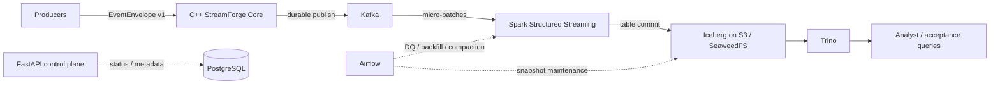
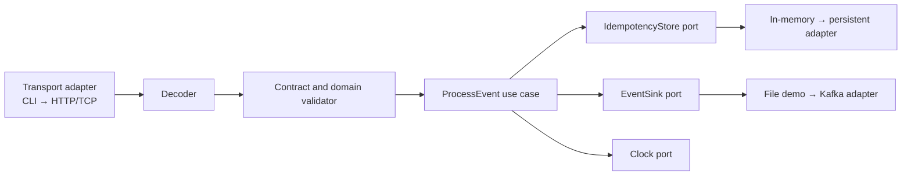
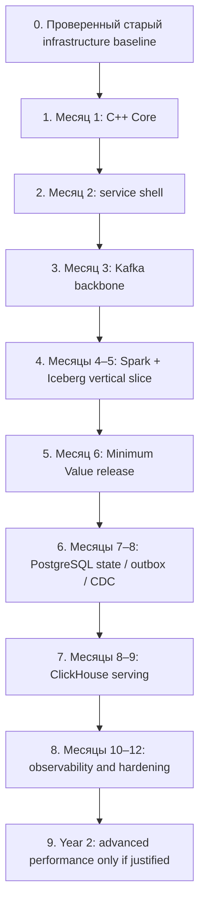

# StreamForge: архитектура и дорожная карта

Дата решения: 21 сентября 2026 года.

Документ объединяет:

- решения из чата «С++»;
- фактическое состояние старого репозитория `/Users/bbzvr/Documents/Codex/streamforge`;
- целевую архитектуру StreamForge;
- требования к MVP;
- границы Minimum Value и Maximum Value;
- план обучения и разработки C++ Core на первый месяц.

## 1. Архитектурное решение

StreamForge развивается как event-driven data platform с производительным C++ ingestion/core и lakehouse-слоем.

Минимально ценная вертикаль:

Основное разделение ответственности:

- **C++ Core** — data plane: контракт, валидация, идемпотентность, ordering и передача в durable sink.
- **FastAPI** — control plane: health, статусы, metadata/admin API и будущий analytics API.
- **Kafka** — durable event log, replay и развязка producer/consumer.
- **Spark** — streaming ingestion, тяжёлые преобразования и backfill.
- **Iceberg + S3** — canonical analytical source of truth.
- **Trino** — интерактивный SQL.
- **Airflow** — DQ, backfill, compaction и snapshot maintenance.
- **ClickHouse** — только optional serving layer для горячих витрин.

## 2. Что уже существует

Старый репозиторий содержит проверенный инфраструктурный каркас:

- FastAPI с `/live` и `/ready`;
- PostgreSQL;
- Redis;
- SeaweedFS с S3 API;
- ClickHouse и Airflow в отдельном Compose-профиле;
- Alembic baseline;
- smoke tests и GitHub Actions.

На 11 сентября 2026 года стенд был проверен на Mac ARM64. Ingestion, worker, ETL, DQ, бизнес-таблицы и витрины в старом репозитории не реализованы.

### Что сохраняем

- Compose и localhost-only development environment;
- bootstrap секретов;
- health/readiness checks;
- SeaweedFS/S3;
- PostgreSQL;
- Airflow и ClickHouse profiles;
- smoke/CI skeleton.

### Что меняем

- FastAPI не становится основным ingestion-сервисом;
- будущий Python worker заменяется C++ Core;
- Redis не используется, пока нет измеренного cache use case;
- ClickHouse не дублирует Iceberg/Trino без отдельного serving SLO.

## 3. Устройство C++ Core

Правило границы: библиотека domain/application не зависит от HTTP, Kafka, PostgreSQL, Spark или Airflow. Инфраструктурные компоненты реализуют узкие interfaces.

### EventEnvelope v1

Обязательные поля:

- `event_id` — стабильный уникальный ID;
- `aggregate_id` — сущность, внутри которой нужен порядок;
- `event_type`;
- `occurred_at` — UTC;
- `schema_version`;
- `producer`;
- `sequence_no` — порядок внутри aggregate;
- `payload`.

## 4. Системные гарантии

### Функциональные требования

- Core возвращает `accepted`, `duplicate` или `rejected` с machine-readable reason.
- В сетевом MVP ACK отправляется только после подтверждения Kafka.
- В outbox-варианте ACK отправляется после commit PostgreSQL.
- Transport работает at-least-once.
- Exactly-once business effect обеспечивается dedup по `event_id`.
- Глобальный exactly-once не заявляется.
- Ordering гарантируется только внутри `aggregate_id`/Kafka partition.
- Все аналитические consumer можно перестроить из Kafka/Iceberg raw.
- `raw` сохраняет источник, `core` типизирован и дедуплицирован, `mart` отвечает на конкретный бизнес-вопрос.

### Нефункциональные требования MVP

- 0 потерянных acknowledged events в fault/restart test.
- 0 дублей в Iceberg core/mart.
- `raw = accepted + quarantined` по reconciliation.
- Безопасный повтор после рестарта.
- Additive schema evolution без остановки pipeline.
- Breaking schema change требует новой major `schema_version`.
- Локальная acceptance-нагрузка: 1 000 событий/с.
- Ориентир p95 ingestion: менее 50 мс.
- Ориентир data freshness: менее 60 секунд.
- Численные показатели должны подтверждаться benchmark report на конкретном железе.

### Семантика отказов

| Сбой | Поведение | Гарантия |
|---|---|---|
| Невалидное событие | Reject до durable publish | Стабильный reason code |
| Повтор `event_id` | Идемпотентный duplicate response | В core одна запись |
| Kafka недоступна | Нет ACK, bounded retry/backpressure | Client может повторить |
| Spark остановлен | Kafka накапливает lag | Продолжение с checkpoint |
| S3/Iceberg недоступен | Micro-batch не коммитится | Offset не подтверждается раньше table commit |
| Breaking schema drift | Quarantine или fail gate | Нет тихой порчи таблиц |
| Small files | Airflow compaction | Контроль количества и среднего размера файлов |
| Trino/ClickHouse недоступен | Ingestion продолжается | Canonical данные не теряются |

## 5. Minimum Value

Срок-ориентир: шестой месяц при нагрузке 8–10 часов в неделю.

Пользователь может:

1. Отправить один тип versioned events.
2. Получить детерминированный accept/reject.
3. Дождаться попадания данных в Iceberg.
4. Выполнить acceptance-запрос через Trino.
5. Перезапустить pipeline без дублей и потерь.

Minimum Value включает:

- C++ ingestion/core;
- Kafka;
- Spark Structured Streaming;
- Iceberg raw/core/одну mart;
- SeaweedFS/S3;
- Trino;
- Airflow DQ и maintenance;
- end-to-end test, CI, demo и runbook.

Не входят:

- PostgreSQL CDC;
- ClickHouse serving;
- dbt;
- Kubernetes;
- multi-region;
- lock-free/custom allocator;
- HFT latency claims.

## 6. Maximum Value v1.0

Срок-ориентир: 10–12 месяцев.

Добавляется только после работающего Minimum Value:

- PostgreSQL operational state;
- transactional outbox + Debezium вместо небезопасного dual write;
- ClickHouse hot marts;
- dbt, если появляется достаточно большой SQL model graph;
- metrics, traces, alerts и SLO;
- schema migration tests;
- load, chaos и recovery tests;
- performance-regression CI;
- security hardening.

Maximum Value не включает автоматически Kubernetes, multi-region, DPDK, RDMA и собственные allocators. Они рассматриваются только после обнаружения измеренного bottleneck.

## 7. Дорожная карта

| Этап | Результат | Gate |
|---|---|---|
| Месяц 1 | C++20 library, CLI, EventEnvelope, validation, ports, tests, sanitizers, benchmark | CP1–CP4 |
| Месяц 2 | HTTP/TCP adapter, bounded queue, graceful shutdown, structured logs | ACK semantics и load test |
| Месяц 3 | Kafka producer, partition contract, retries, backpressure, replay | No-loss restart test |
| Месяцы 4–5 | Spark → Iceberg raw/core, backfill и reconciliation | Canonical tables queryable |
| Месяц 6 | Trino, mart, Airflow maintenance, E2E и demo | Minimum Value release |
| Месяцы 7–8 | PostgreSQL state и transactional outbox/CDC | Crash-consistent state/events |
| Месяцы 8–9 | ClickHouse hot mart и API | Serving p95 подтверждён |
| Месяцы 10–12 | Observability, evolution, load/chaos/recovery | Maximum coherent v1.0 |

Каждая стадия обязана работать без следующей.

## 8. Первый месяц: C++ Core

Ритм: четыре сессии по 90–120 минут и один checkpoint/demo на 2–3 часа каждую неделю.

### Неделя 1: язык, lifetime и build

- [ ] Сессия 1. Создать C++20 workspace: `sf_core`, `sf_cli`, `sf_tests`, CMake и warnings-as-errors.
- [ ] Сессия 2. Сделать восемь экспериментов: value, reference, const reference, pointer и копирование.
- [ ] Сессия 3. Разобрать scope/lifetime, намеренно создать dangling/use-after-free и поймать ASan.
- [ ] Сессия 4. Создать `EventId`, `AggregateId`, `EventType`, `SchemaVersion`.
- [ ] Сессия 5. Подключить GoogleTest/CTest и написать тесты domain types.

Checkpoint CP1:

- проект собирается одной командой;
- domain library не зависит от infrastructure;
- минимум 10 тестов;
- ASan обнаруживает учебную memory error.

### Неделя 2: RAII, ownership и validation

- [ ] Сессия 6. RAII, `unique_ptr`/`shared_ptr` в учебных опытах; production types строить по Rule of Zero.
- [ ] Сессия 7. Инструментировать copy/move и увидеть реальные операции.
- [ ] Сессия 8. Применить `vector`, `unordered_set`, `string_view` и algorithms.
- [ ] Сессия 9. Создать `ValidationError` и явный `Result`.
- [ ] Сессия 10. Реализовать `EventEnvelopeValidator` и 15+ тестов.

Checkpoint CP2:

- невозможно незаметно создать невалидный `EventEnvelope`;
- validator возвращает стабильные error codes;
- boundary cases покрыты тестами.

### Неделя 3: архитектура ядра

- [ ] Сессия 11. Зафиксировать EventEnvelope v1.
- [ ] Сессия 12. Реализовать JSON round-trip одной библиотекой.
- [ ] Сессия 13. Реализовать `ProcessEventUseCase` без зависимости от CLI/файлов/Kafka.
- [ ] Сессия 14. Добавить `IdempotencyStore`, `EventSink`, `Clock` interfaces и fakes.
- [ ] Сессия 15. Зафиксировать duplicate и sequence-gap semantics тестами.

Checkpoint CP3:

- use case работает только через interfaces;
- второй `event_id` не создаёт вторую запись;
- поведение sequence gap проверено тестом.

### Неделя 4: демонстрируемая вертикаль

- [ ] Сессия 16. `sf_cli` читает NDJSON и пишет accepted/rejected JSON.
- [ ] Сессия 17. Добавить append-only `FileEventSink` только для демо.
- [ ] Сессия 18. Добавить malformed JSON, duplicate, timestamp и sequence negative tests.
- [ ] Сессия 19. Запустить ASan, UBSan и release benchmark; сохранить baseline.
- [ ] Сессия 20. Провести demo: 1 000 событий → accepted/rejected → replay; оформить README и ADR-001.

Checkpoint CP4:

- NDJSON demo воспроизводится одной командой;
- tests, ASan и UBSan проходят;
- benchmark сохранён без маркетинговых claims;
- ADR объясняет contract, guarantees и out-of-scope.

### Go/no-go перед вторым месяцем

Kafka пока не добавляется, если ты не можешь самостоятельно:

- объяснить lifetime, RAII, copy/move и ownership;
- добавить поле в контракт и обновить тесты;
- объяснить duplicate и ordering semantics;
- диагностировать падение sanitizer;
- провести CLI demo без ручного исправления данных.

## 9. Что запрещено добавлять в первый месяц

- Kafka client;
- HTTP framework;
- многопоточность;
- lock-free queue;
- custom allocator;
- DPDK, RDMA и `io_uring`;
- Kubernetes;
- преждевременная оптимизация.

## 10. Учебные материалы

Основные:

- [LearnCpp](https://www.learncpp.com/) — types, references, pointers, functions, scope и classes.
- [C++ Core Guidelines](https://isocpp.github.io/CppCoreGuidelines/CppCoreGuidelines) — resource management, functions и classes.
- [cppreference](https://en.cppreference.com/w/cpp) — справочник, а не линейный курс.
- [Compiler Explorer](https://godbolt.org/) — эксперименты с copy/move, warnings и generated code.
- [Official CMake Tutorial](https://cmake.org/cmake/help/latest/guide/tutorial/index.html) — executable, library и testing.
- [GoogleTest Primer](https://google.github.io/googletest/primer.html) — первые unit tests.
- [Clang AddressSanitizer](https://clang.llvm.org/docs/AddressSanitizer.html) — memory errors.
- [Clang UndefinedBehaviorSanitizer](https://clang.llvm.org/docs/UndefinedBehaviorSanitizer.html) — undefined behavior.

Не проходить несколько курсов параллельно. Теория должна занимать не более 35% времени; каждая тема заканчивается кодом, тестом или измерением.

## 11. Definition of Done первого месяца

- [ ] C++20 проект собирается и тестируется одной командой.
- [ ] Есть отдельные targets `sf_core`, `sf_cli`, `sf_tests`.
- [ ] Зафиксирован EventEnvelope v1.
- [ ] Есть validation result со стабильными error codes.
- [ ] Есть `IdempotencyStore`, `EventSink`, `Clock` interfaces и fakes.
- [ ] Работает NDJSON CLI demo.
- [ ] Написано минимум 25 осмысленных тестов.
- [ ] ASan и UBSan проходят.
- [ ] Warnings считаются ошибками.
- [ ] Сохранён release benchmark baseline.
- [ ] ADR-001 фиксирует решения и ограничения.
- [ ] README позволяет повторить demo с чистого checkout.

